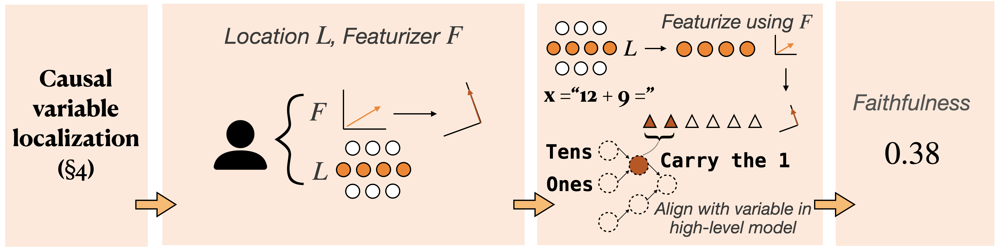

<p align="center">
    <a>
    
    </a>
</p>

<p align="center">
    <!-- <h3 align="center">A <b>M</b>echanistic <b>I</b>nterpretability <b>B</b>enchmark</h3> -->
        A benchmark for systematic comparison across <emph>featurization</emph> and <emph>localization</emph> methods.
        <br/>
        <sub>
            <strong>circuits · causal variables · localization · featurization · faithfulness · interchange interventions · SAEs · counterfactuals</strong>
        </sub>
</p>

<p align="center" style="color: #cccccc">
    <a href="LICENSE.md"></a>
    <a href="mailto:mueller@technion.ac.il"></a>
    <a href="TODO"></a>

</p>

- [About MIB](#overview)
- [Tracks](#tracks)
    - [Circuit Localization](#circuit-localization)
    - [Causal Variable Localization](#causal-variable-localization)
- [Data and Models](#data-and-models)
- [Leaderboard](#leaderboard)
- [Submission](#submission)
- [Citation](#citation)

# Overview

This repository documents the **M**echanistic **I**nterpretability **B**enchmark (**MIB**). Here, you can find links to the code for both tracks, information about and links to our datasets, information about the **MIB** leaderboard, instructions for submission, and a citation that we ask you use if you use any of the resources provided here or at the links provided below.

# Tracks

**MIB** contains two tracks. The [*circuit localization track*](#circuit-localization) benchmarks methods that aim to locate graphs of causal dependencies in neural networks. The [*causal variable localization track*](#causal-variable-localization) benchmarks methods that aim to locate specific human-interpretable causal variables in neural networks.

## Circuit Localization
<p align="center">
    <a>
    
    </a>
</p>

This track benchmarks circuit discovery methods—i.e., methods for locating graphs of causal dependencies in neural networks. Most circuit discovery pipelines look something like this:

1. Compute importance scores for each component or each edge between components.
2. Ablate all components from the network except those that surpass some importance threshold, or those in the top k%.
3. Evaluate how well the circuit (model with only the most important components not ablated) performs, or replicates the full model's behavior.

In the circuit localization track's repository, we provide code for discovering and evaluating circuits.

Notice that step (3) mentioned *two distinct* evaluation criteria: how well the circuit performs, and how well the circuit replicates the model's behavior. Past work often implicitly conflates these two, whether by discovering a circuit using one criterion and then evaluating another, or by not clarifying the precise goals. We believe these are complementary but separate concepts, so we split them into two separate evaluation metrics. See circuit localization repo or the paper for more details.

## Causal Variable Localization
<p align="center">
    <a>
    
    </a>
</p>

This track benchmarks featurization methods—i.e., methods for transforming model activations into a space where it's easier to isolate a given causal variable. Most pipelines under this paradigm look like this:

1. Curate a dataset of contrastive pairs, where each pair differs only with respect to the targeted causal variable.
2. If using a supervised method, train the featurization method using the contrastive pairs.
3. To evaluate: feed the model an input from a pair, use the featurizer to transform an activation vector, intervene in the transformed space, transform back out, and see whether the model's new behavior aligns with what is expected under the intervention.

In the causal variable localization track's repository, we provide code for training and evaluating featurizers.

# Data and Models

Our benchmark consists of four datasets: IOI, MCQA, Arithmetic, and ARC. These were chosen to represent (1) a mixture of commonly studied and unstudied tasks, (2) tasks of varying formats, and (3) tasks of varying difficulty levels. Each dataset comes with 

Mechanistic interpretability comparisons are only valid for a given task-and-model pair. Thus, we choose four realisitic language models of varying sizes and capability levels to standardize comparisons: GPT-2 Small, Qwen-2.5 (0.5B), Gemma-2 (2B), Llama-3.1 (8B). We also include an InterpBench model, which we train to encode a ground-truth circuit for the IOI task.

## InterpBench: A Ground-truth Circuit

Language models, when trained according to a next-token prediction objective, encode unpredictable mechanisms and concepts. Thus, it is difficult to define metrics that capture any notion of a ground-truth. For the circuit localization track, we therefore also include an InterpBench model, which we train to encode a known mechanism that we specify. Because we know what the ground-truth nodes and edges are in the circuit, we can compute more meaningful metrics, like the AUROC!

For more detail on how InterpBench models are trained, please see the [InterpBench paper](https://arxiv.org/abs/2407.14494).

# Leaderboard

To encourage participation, we have created a leaderboard, hosted on HuggingFace. This leaderboard shows scores on the *private* test set. We have set a strict rate limit of 2 submission per user per week to discourage hill-climbing on the private test set.

Our hope is that the public dev and test sets will enable fast iteration on mechanistic interpretability methods, while the private test will remain a more stable and meaningful measure of the state of the art.

# Submission

To submit to the **MIB** leaderboard, you will need the following:
- Circuit localization: 10 circuits per model/task combination. These should be of varying sizes, and satisfy the criteria described in the circuit localization repo.
- Causal variable localization: a featurization function that follows the API format specified in the causal variable localization repo.

Please ensure that your submission is valid using our automated submission checker script. Once you've verified, please contact the organizers and provide HuggingFace links to your required files. 

We are working on automated submission handling; stay tuned!

# Citation
If you use any of the **MIB** datasets or code, please cite us!
```
@article{mib-2025,
    title = {{MIB}: A Mechanistic Interpretability Benchmark},
    author = {Aaron Mueller and Atticus Geiger and Sarah Wiegreffe and Dana Arad and Iv{\'a}n Arcuschin and Adam Belfki and Yik Siu Chan and Jaden Fiotto-Kaufman and Tal Haklay and Michael Hanna and Jing Huang and Rohan Gupta and Yaniv Nikankin and Hadas Orgad and Nikhil Prakash and Anja Reusch and Aruna Sankaranarayanan and Shun Shao and Alessandro Stolfo and Martin Tutek and Amir Zur and David Bau and Yonatan Belinkov},
    year = {2025},
    note = {To appear},
    journal = {arXiv preprint}
}
```

# License
We release the content in this repository and all sub-repositories under an Apache 2.0 license.